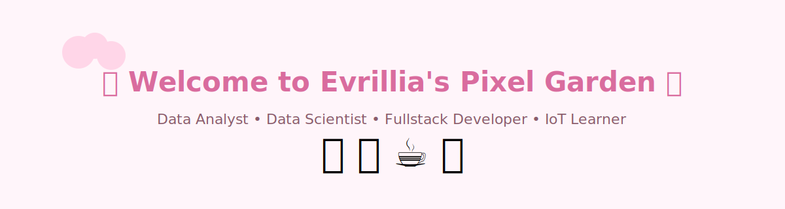

# Evrillia
<div align="center">

# 🌸 Welcome to Evrillia's Pixel Garden 🌸





<br>

🌷 Data Analyst • 📊 Data Scientist • 💻 Fullstack Developer • 🤖 IoT Learner

<br><br>

<a href="#about">🏡 Home</a> •
<a href="#about">🌸 About</a> •
<a href="#tech-stack">💻 Tech Stack</a> •
<a href="#projects">📂 Projects</a> •
<a href="#learning-journey">📚 Learning</a> •
<a href="#contact">💌 Contact</a>

</div>

---


# 🌸 About Me


Hi! I'm **Evrillia** 💕

I enjoy transforming **raw data into meaningful insights**, building **modern web applications**, and exploring **IoT technologies** to solve real-world problems.

Currently, I'm focusing on:

- 📊 Data Analysis
- 🧠 Data Science
- 💻 Fullstack Development
- 📡 Internet of Things (IoT)
- ☁️ Cloud & Deployment
- 🌱 Continuous Learning

> *"Every project is another step to becoming a better engineer."*

<br>

---


# 💌 Currently Brewing


```text
☕ Current Focus

██████████░░░░░░ 60%

🌸 Learning ESP32
🌸 Building IoT Dashboard
🌸 Improving Machine Learning Skills
🌸 Exploring Data Visualization
```

---


# 📚 Learning Journey

| Skill | Progress |
|-------|----------|
| Python | ██████████ 95% |
| SQL | ██████████ 95% |
| Data Analysis | █████████░ 90% |
| Machine Learning | ████████░░ 80% |
| Laravel | █████████░ 90% |
| React | ███████░░░ 70% |
| Docker | ██████░░░░ 60% |
| ESP32 / IoT | █████░░░░░ 50% |

---


# 💻 Tech Stack

### Languages

<p>


</p>

### Frontend

<p>


</p>

### Backend

<p>


</p>

### Database

<p>


</p>

### Data Science

<p>


</p>

### Tools

<p>


</p>

---


# 📂 Featured Projects

🌸 Data Analytics Dashboard

📈 Machine Learning Classification

💻 Laravel Fullstack Application

🤖 IoT Monitoring System

🌱 More projects coming soon...

---


# 📊 GitHub Statistics

<div align="center">


</div>

---

<div align="center">


</div>

---


# 🐍 Contribution Snake

<div align="center">


</div>

---


# ☕ Pixel Coffee Counter

```text
Today's Energy

☕☕☕☕☕☕☕░░░

Coffee Level : 70%
```

---


# 🌸 Pixel Room

<div align="center">


</div>

---


# 💌 Contact

<p align="center">

<a href="https://github.com/YOUR_USERNAME">

</a>

<a href="https://linkedin.com/in/YOUR_LINKEDIN">

</a>

<a href="mailto:YOUR_EMAIL">

</a>

</p>

---

<div align="center">


### 🌸 Thank you for visiting my Pixel Garden 🌸

*"Keep learning, keep building, keep growing."*

⭐ If you like my projects, don't forget to leave a star!

</div>
